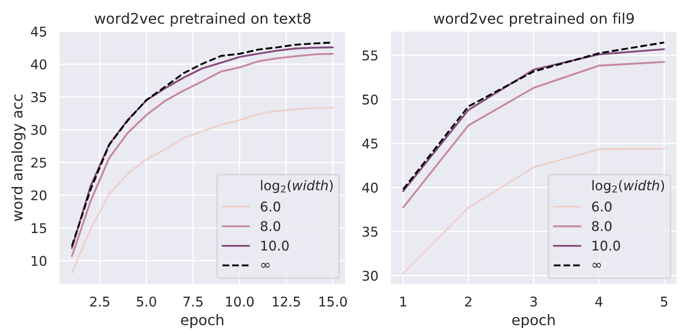
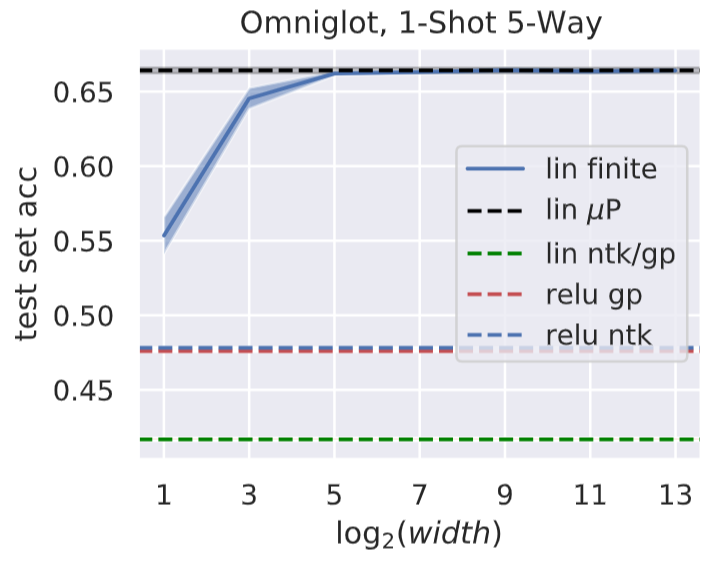

Empirical Experiments in "Feature Learning in Infinite-width Neural Networks"
========

This repo contains code to replicate our experiments (Word2Vec, MAML) in the paper *Feature Learning in Infinite-Width Neural Networks*.

Our results on Word2Vec:

Our Results on MAML:

Please see the README in individual folders for more details.

This is the 4th paper in the Tensor Programs series ([[0]](http://arxiv.org/abs/1902.04760)[[1]](http://arxiv.org/abs/1910.12478)[[2]](http://arxiv.org/abs/2006.14548)[[3]](http://arxiv.org/abs/2009.10685)). Also see here for code in previous papers for calculating the [GP](https://github.com/thegregyang/GP4A) and [NTK](https://github.com/thegregyang/NTK4A) limits of wide neural networks.
